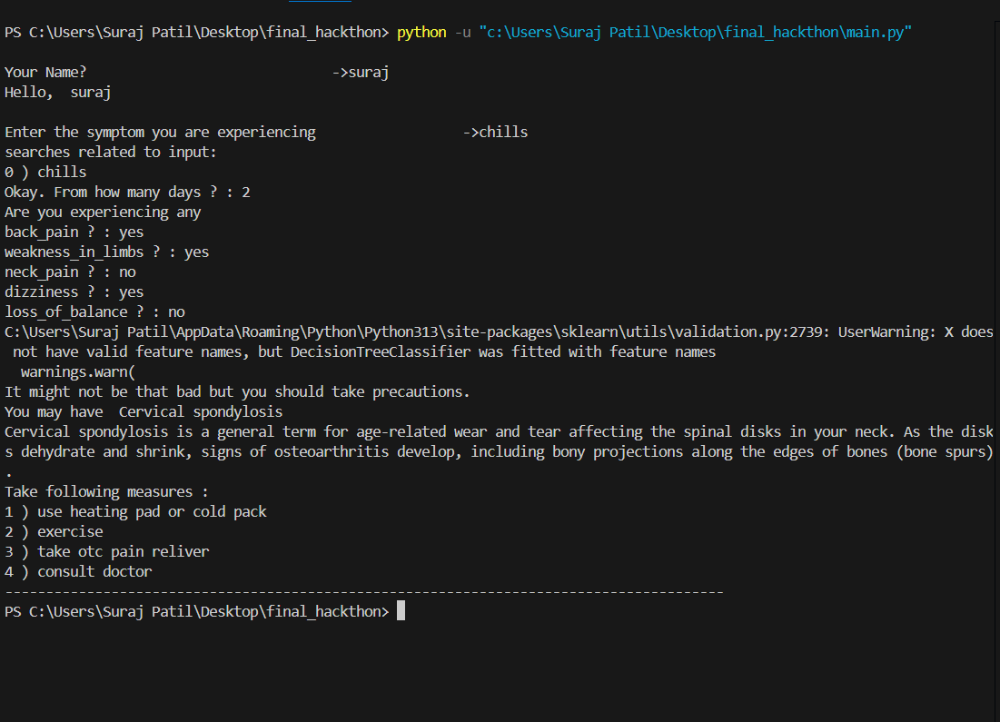
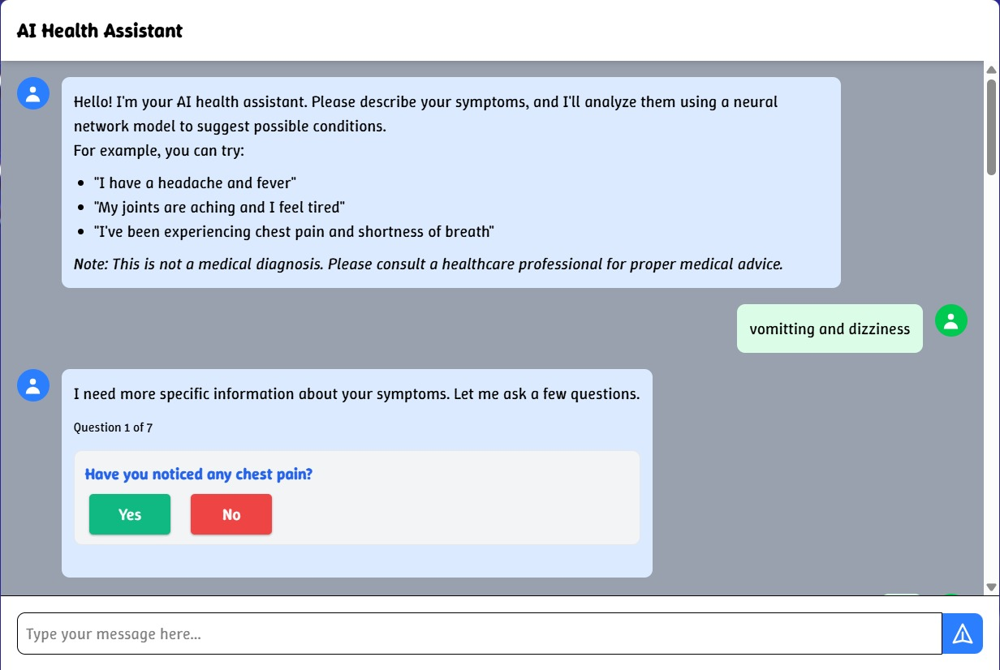

<h1>
<legend>📌 Project Title: Personalized Treatment Optimization using Reinforcement Learning</legend>
</h1>

<h2>🎯 Objective:</h2>

To develop a reinforcement learning-based system that can recommend personalized medical treatments for patients by learning optimal strategies from historical clinical data. The goal is to maximize patient outcomes such as recovery rates, minimize side effects, and adapt treatment over time based on patient response.

<h2>🧠 Background:</h2>

Traditional medical treatment often relies on fixed protocols or physician experience, which may not be optimal for every individual. Personalized medicine aims to tailor treatments based on specific patient characteristics (e.g. genetics, medical history, lifestyle).

Reinforcement Learning (RL) is well-suited for this task because:
<ol>
It can model sequential decision-making (e.g., treatment over time).

It learns optimal policies based on feedback (rewards) from the environment (patient outcomes).</ol>

<h2>⚙️ Methodology:</h2>
<ol><li><h2>Data collection</h2></li>
<ul><li>Electronic Health Records (EHRs)</li>
<li>Patient demographics, symptoms, diagnoses, treatments, outcomes</li>
<li>Time-series health data</li></ul>

<li><h2>State Representation</h2></li>
<ul><li>Define the state as the current patient status: lab results, vitals, comorbidities, etc.</li>
<li>Use feature engineering or neural networks (e.g., LSTM for temporal info) to encode states</li></ul>

<li><h2>Reward Function</h2></li>
<ul><li>Outcome-based: improvement in health, survival, reduction in symptoms, side effects.</li>
<li>Needs to be carefully designed to reflect clinical goals</li></ul>

<li><h2>Model</h2></li>
<ul><li>Q-Learning / Deep Q-Networks (DQN)</li>
<li>Policy Gradient Methods</li>
<li>offline RL</li></ul>
</ol>

<h2>🧪 Technologies & Tools:</h2>
<ol><li>Python, TensorFlow / PyTorch
Pandas, Scikit-learn</li>
<li>Pandas, Scikit-learn</li>
<li>EHR data formats like FHIR</li>
</ol>
    

<h2>🚀 Future Enhancements:</h2>
<ul><li>Integrate causal inference to better understand treatment effects
</li>
<li>Use multi-agent RL for co-treatment planning</li>
<li>Real-time decision support integration in hospital systems</li>

<h2>Machine Learning Output</h2>

<h1>Dataset Used</h1>
<ol><li>dataset.csv</li>
<li>Training.csv</li>
<li>testing.csv</li>
<li>Symptom_decription.csv</li>
<li>Symptom_precaution.csv</li>
<li>Symptom_severity.csv</li></ol>

<h1>User interfaces<h1>
